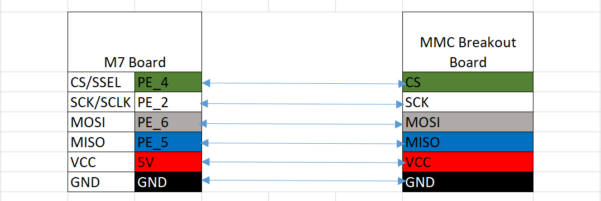

# A Guide to run SDO and mbed cloud client on Cortex-M7 based Board

# Table of Contents
1. [Hardware requirements](#Hardware_requirements)
2. [Software Requirement](#Software_Requirement)
3. [Hardware Connection Information](#Hardware_Connection_Information)
4. [Repository Access](#Repository_Access)
5. [Building C-Code-SDK](#Building_C-Code-SDK)
6. [Configuring and Running the dmssdk](#Configuring_and_Running_the_dmssdk)
7. [Running the C-Code-SDK](#Running_the_C-Code-SDK)
8. [Output / Observation](#Output)
9. [Links](#Links)


## 1. Hardware requirements:<a name="Hardware_requirements"></a>
1. STM32 Nucleo-144 development board with STM32F767ZI MCU. [Nucleo-144 STM32F767ZI](https://os.mbed.com/platforms/ST-Nucleo-F767ZI/)
2. SPI based micro SD card breakout board. [Recommended](https://www.amazon.com/WINGONEER-reader-module-interface-conversion/dp/B06XHJJWNC/ref=asc_df_B06XHJJWNC/?tag=hyprod-20&linkCode=df0&hvadid=241989349889&hvpos=1o2&hvnetw=g&hvrand=12683401218837564249&hvpone=&hvptwo=&hvqmt=&hvdev=c&hvdvcmdl=&hvlocint=&hvlocphy=1014249&hvtargid=pla-494911947007&psc=1)
3. SanDisk 8/16GB microSD Memory Card [Recommended](https://www.croma.com/sandisk-16gb-microsd-memory-card/p/158981)
4. Ethernet Cable.
5. Jumper wires.
6. Micro-USB Cable.

## 2. Software Requirements:<a name="Software_Requirement"></a>
1. Ubuntu Linux 16.04
2. mbed-cli (version 1.7.5). [mbed-cli](https://pypi.org/project/mbed-cli/)
3. ARM Cross compiler - [gcc-arm-none-eabi-6-2017-q2-update](https://developer.arm.com/open-source/gnu-toolchain/gnu-rm/downloads/6-2017-q2-update)
4. Configure the toolchain by setting GCC_ARM through mbed-cli. [configuring-mbed-cli](https://os.mbed.com/docs/v5.7/tools/configuring-mbed-cli.html)
```bash
mbed config  GCC_ARM <Path to gcc-arm-none-eabi-6-2017-q2-update>/bin/arm-none-eabi-gcc

```


## 3. Hardware Connection Information:<a name="Hardware_Connection_Information"></a>


## 4. Repository Access: <a name="Repository_Access"></a>
Send repository access request mail to jeshwanth.kumar.nk@intel.com and cc rohit.dhawan@intel.com for below repositories access.
1. https://github.intel.com/jkumarnk/C-SDK-Device-Modules_Cloud-Client
2. https://github.intel.com/jkumarnk/pelioncreds_sample - (These creds are strictly for demo purposes) (TODO: Change the file names from pem to der)
3. https://github.intel.com/jkumarnk/simple-mbed-cloud-client-module-enable
4. https://github.intel.com/jkumarnk/mbed-cloud-client_module_enable


## 5. Building C-Code-SDK:<a name="Building_C-Code-SDK"></a>

Clone C-SDK-Device-Modules (C-SDK-Device-Modules_cloud-Client)

```bash
git clone git@github.intel.com:jkumarnk/C-SDK-Device-Modules_cloud-Client.git
```

Clone C-Code_SDK:

```bash
git clone git@github.intel.com:SDO/C-Code-SDK.git

git checkout phase_2a.2

```

Export Below variables:

```bash
export SDO_SYS_ROOT=<Path-To-C-SDK-Device-Modules_cloud-Client>/sdo_sys
export DEVCONFIG_ROOT=<Path-To-C-SDK-Device-Modules_cloud-Client>/devconfig
export UTILS_ROOT=<Path-To-C-SDK-Device-Modules_cloud-Client>/utils
export KEYPAIR_ROOT=<Path-To-C-SDK-Device-Modules_cloud-Client>/keypair
export SAFESTRING_ROOT=<Path to Safestring>
export MANUFACTURER_DN=<Manufacturer IP Address>
```
Note: Download safestring from repositories mentioned in the [Links](#Links) section.

Build using below command to generate binary: (Inside C-Code-SDK directory)

For ECDSA:

```bash
make TARGET_OS=mbedos PK_ENC=rsa DA=ecdsa HTTPPROXY=false MODULES=true
```

## 6. Configuring and Running the dmssdk: <a name="Configuring_and_Running_the_dmssdk"></a>

1. Download SDO release binaries. [link](https://teamcity-or.intel.com/viewLog.html?buildId=2417835&tab=artifacts&buildTypeId=MarshalPoint_GenerateReleasePackage_GenerateRelease140Package) - This demo is tested with the SDO release binary of version 1.4 please use the same.

2. Download the pelion cloud sample creds and config files from [pelioncreds_sample](https://github.intel.com/jkumarnk/pelioncreds_sample) and copy it to the directory where owner sdo.properties kept.

3. Edit the file sdo.properties file available in owner directory and set below mentioned variables before running the dmsfileimpl.

```bash
packages.cmd=

packages.fname=account_id,device_cert.pem,device_priv_key.pem,end_point,root_ca_cert.pem,serve_uri
```
4. Please follow the dmssdk [README](https://github.intel.com/SDO/dmssdk/blob/master/README.md) file for running dmssdk and CRI servers.  

Note: For more details or issues faced while running dms-sdk, contact dms-sdk team 

## 7. Running the C-Code-SDK: <a name="Running_the_C-Code-SDK"></a>
Flash the nvFlash eraser, It will clear the flash storage:  
Note: Mount /media/${USER}/NODE_F767ZI1/ before executing below command.

```
cp mbedos/components/build/mbedos/debug/NUCLEO_F767ZI/app/nverase.bin /media/${USER}/NODE_F767ZI1/
```
Wait for 5 seconds to complete the flashing, unmount and mount NODE_F767ZI1.

Open the serial port to view the stdout:
```bash
mbed sterm --port /dev/ttyACMX -b 115200
```

Flash the compiled binary
```bash
cp mbedos/components/build/mbedos/debug/NUCLEO_F767ZI/app/sdo.bin  /media/${USER}/NODE_F767ZI1/
```

**Note:**  
1. In the device ttyACMX, X can be - 0, 1, 2 etc based on the assignment by OS.  
2. The microSD card needs to be inserted before running C-Code_SDK by Formatting it into FAT32 filesystem.

## 8. Output / Observation:<a name="Output"></a>

1. The first run of C-Device-SDK completes DI and flash the following message in serial terminal.
```bash
   ------------------------------------ DI Successful --------------------------------------
```  
2. Please extend the proxy and wait for TO0 completes (Refer dmssdk Readme file.)
3. Reset the Board either by hard reset button or Ctrl+B in sterm terminal.
4. Following messages makes sure the SDO completed successfully and connected to mbed cloud endpoint name 016796abf1110000000000010010028c.

```bash

------------------------------------ TO2 Successful --------------------------------------

@@@@@@@@@@@@@@@@@@@@@@@@@@@@@@@@@@@
@Secure Device Onboarding Complete@
@@@@@@@@@@@@@@@@@@@@@@@@@@@@@@@@@@@

```

```bash

Connected to Mbed Cloud. Endpoint Name: 016796abf1110000000000010010028c

```
5. The board is connected to mbed cloud.

## 9. Links <a name="Links"></a>
1. C-SDK-safestring - https://github.intel.com/SDO/C-SDK-Safestring
